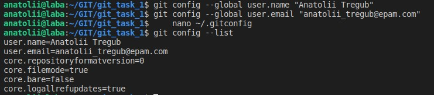
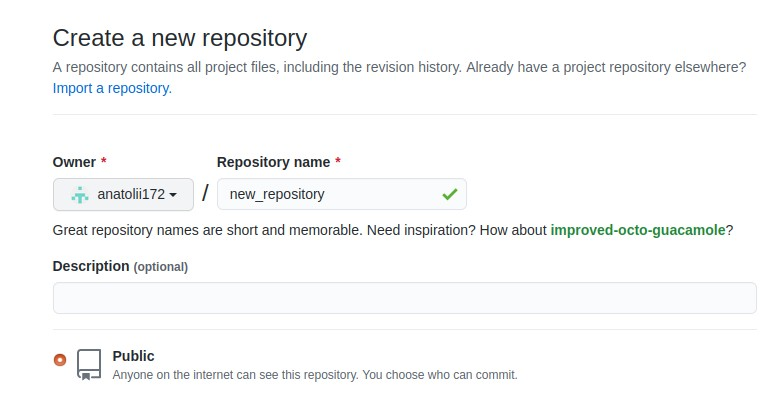

- Установите git и сгенерируйте пару ssh ключей. Авторизуйте  публичный ключ на github.com.

ssh-keygen -b 4096 -C "anatolii_tregub@epam.com"
 
- Укажите свой user.name и user.email в git.

git config --global user.name "Your Name"
git config --global user.email "youremail@domain.com"

- Создайте новый репозиторий на github.com и склонируйте его локально на свой компьютер.

- Создайте файл названием song.txt и поместите туда половину текста  любимой песни.

- Сделайте коммит с названием "add first half of my favorite song" и отправьте его на сервер.
- Убедитесь что на github есть файл song.txt с текстом песни.
- Используя веб-интерфейс гитхаба добавьте вторую половину текста песни и сделайте коммит с названием "finish my song".
- В локальном репозитории сделайте pull и убедитесь что коммит, который вы создали на github, подтянулся и у вас полный текст песни.
